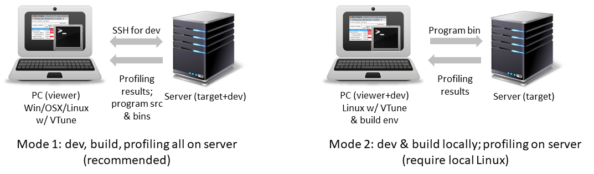

# Concurrency

This project has two experiments. 

For each experiment, clone the whole repository first. Then follow the demo description, tinker with the given benchmark program, and reproduce the demo results. Then, do the exercises and submit your answers. 

## Work with the server
An overview figure. See details below. 


## Prerequisite: connect to server

This experiment should be finished on the **granger1** server. NOT **labsrv06** which many of you use in project 1!

To log in to `granger1` from your local machine, you could manually connect to `portal` and then `granger1` as described ([here](https://www.cs.virginia.edu/wiki/doku.php?id=linux_ssh_access)). 

As you see: this is tedious. Read this 5-min [tutorial](ssh-proxy.md) to simplify your workflow. 

### (Optional) Run benchmarks on your local Linux machine instead of granger1? 

Make sure your machine has more than a dozen of cores (not "threads". e.g. Ryzen 9, Threadripper, some Intel i9). Recommended OS: Ubuntu 18.04 or 20.04. Other Linux distros should work as well. Windows: native compliation should work but need adaptation. WSL not recommended. 

```
sudo apt install build-essential
sudo apt install cmake gcc gcc-aarch64-linux-gnu 
# python for plotting
sudo apt install python3 python3-pip
pip3 install bokeh
```

## Build the given code

[CMake](cmake.md)

(I intentionally avoid giving a "quickstart" here to make sure you read & experiment)

## Set up profiler/tracer

* [Intel VTune](./vtune.md)

* [A simple tracing facility](./measurement.md) 

## Experiments

* **Exp1: Races & Synchronization** 
  * [Demo](./exp1.md)
  * [Exercises](./exp1-assignment.md) (cs6456 students: refer to MS teams for your assignments instead)
* **Exp2: Scalability** 
  * [Demo](./exp2.md)
  * [Exercises](./exp2-assignment.md) (cs6456 students: refer to MS teams for your assignments instead)


*Credits: inspired by UCLA "Operating Systems Principles"*