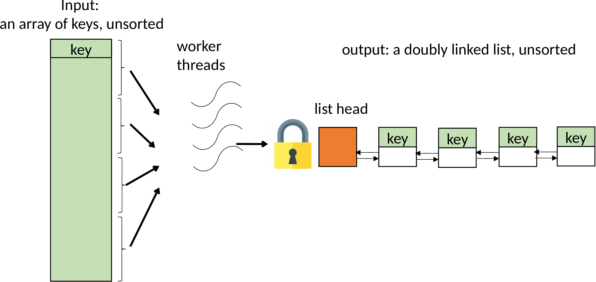
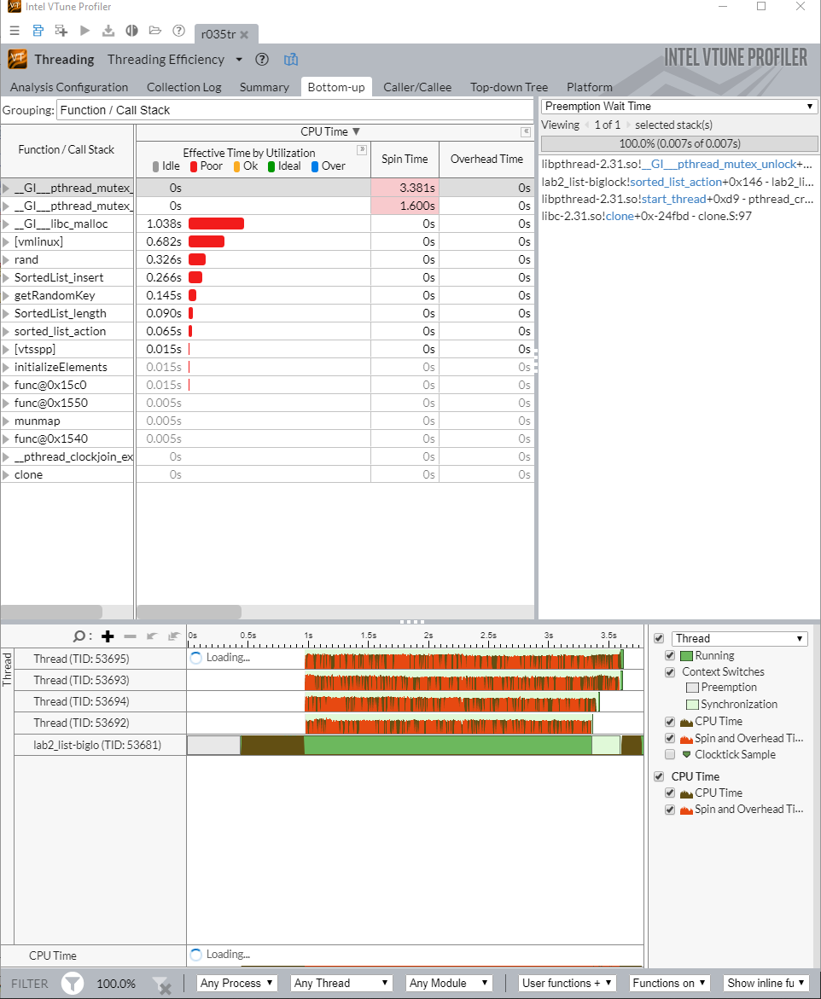
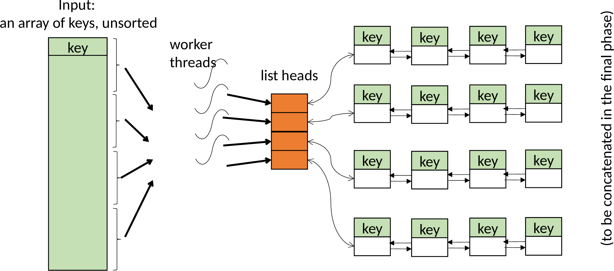
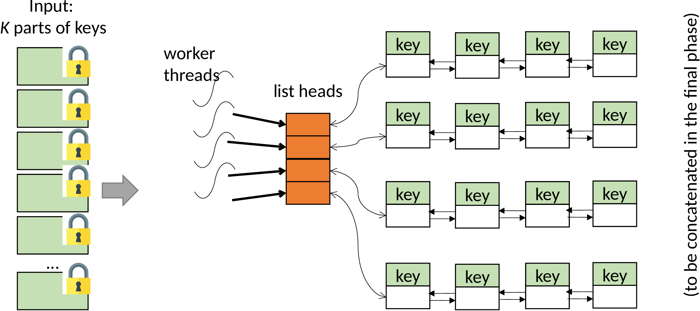
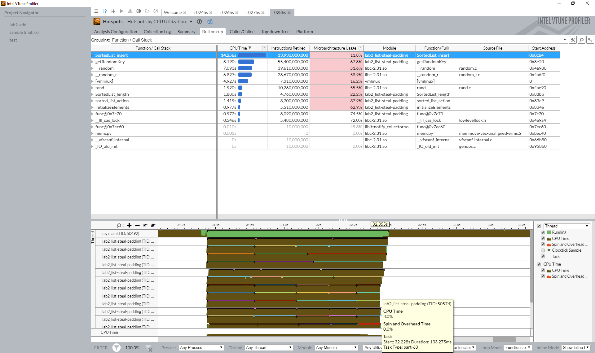
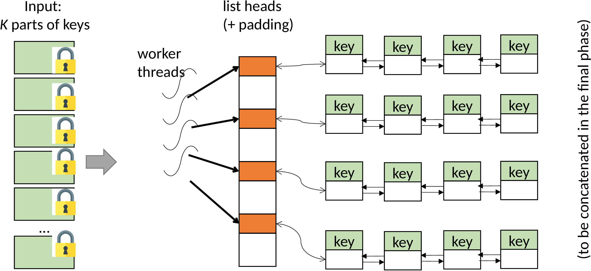

Scalability 
=============================================

**Choose your server:** 
[here](https://fxlin.github.io/p2-concurrency/#which-server)

In the previous experiment, synchronization prevents racy access to a shared variable. In this experiment, we will study the overhead of synchronization, as well as how to overcome the resultant bottleneck.  

Objectives
-------------------

*   primary: demonstrate the ability to recognize scalability bottlenecks on data structures
*   primary: experience with partitioning a serialized resource to improve parallelism
*   primary: know that scalability takes a **system approach** and is often not as easy as one may think.
*   primary: experience with a modern profiler 
*   secondary: experience with finding, installing, and exploiting new libraries and tools. 

## The benchmark

We will study a simple program (list.c) that inserts 64-bit integer keys into a doubly linked list. The figure below illustrates the execution timeline. 


* in the init phase, one thread pre-generates keys and stores them in a table in memory
* in the parallel phase, multiple threads read keys from the table and insert them to a shared linked list
* the keys can be unsorted in the table, and can be unsored in the linked list

This benchmark is for educational purpose. The reason we use a linked list is for simplicity. A more useful concurrent data structure would be hashtable, which we will see in the exercise. 

## Measuring performance 

### Metrics

We care about two metrics: 

1. the program's *overall performance*, which is characterized by **its aggregate throughput**, i.e. key insertions per second by all threads combined. 
2. *scalability*: how much the throughput increases as we use more threads (cores) in  the program. 

### Methodologies

We have to run our benchmark for sufficiently long (more than a few seconds). Otherwise, the measurement will be distorted by the startup cost (cache warmup, kernel scheduling, etc.) and sampling errors (e.g. VTune samples context switches at millisecond intervals). 

**How to measure throughput?**  We will instrument the benchmark source code with *clock_gettime*(), before and after the parallel phase, to measure `time_diff`.  This is shown in the figure above. Our measurement focuses on the parallel phase, and excludes the time of init phase (e.g. key generation) from measurement. 

> Q: before we measure anything, make an educated guess of the throughput ballpark. 

**The scalability plot**

With the same number of iterations (i.e. total number of keys to insert by each thread), we run the benchmark with different numbers of threads. Each run will report its throughput, e.g. 

```
$./list --iterations=1M --threads=1 
..
test=list-none threadNum=1 iterations=1000000 numList=1 numOperation=1000000 runTime(ms)=115 tput(Mops)=8.63
$./list --iterations=1M --threads=2
..
```

To automate the test, we provide a boilerplate script called `run.sh`, which launches the benchmark in multiple runs. For each run, the script redirects the program's output (both stdout and stderr) to a txt file. 

```bash
# see run.sh for more details
for tr in 1 2 4 8 
do 
	$VTUNE $PROG --iterations=$ITER  --threads=$tr --lists=`expr $tr \* $FACTOR` >> $TRACEFILE 2>&1   
done
```

You need to understand `run.sh` and make your adjustment. 

FYI -- A Python script `scripts/plot.py` parses multiple such txt files from a set of runs and produces a scalability plot. All plots below are generated by the Python script. Feel free to use & adapt `plot.py`.  Check out its comments for details. 

All following experiments are done with the following parameters: 1M keys (iterations) per thread, 1-8 threads. 

## The source code structure

We maintain one copy of source code with all the fixes (or "features") needed for scalability. These fixes can be turned on/off at the compile time, controlled via a set of compilation flags in C. When we type `make`, our makefile (generated by CMake) will build the same source code with different combinations of compilation flags, producing a series program binaries with different fixes on or off. 

In the discussion below, we start with all fixes off, incrementally turn on fixes, and show the resultant scalability. You will see why each fix matters and to what extent it matters. 

FYI -- here is a list of all the program versions we will examine. 

| Program name suffix ("list-XXX") | list(s)           | memory allocation | load balancing | eliminating false sharing |
| -------------------------------- | ----------------- | ----------------- | -------------- | ------------------------- |
| N/A, aka "biglock"               | One big list      | malloc()          | No             | No                        |
| -p                               | Partitioned lists | malloc()          | No             | No                        |
| -pm                              | Partitioned lists | pre-allocated     | No             | No                        |
| -pml                             | Partitioned lists | pre-allocated     | Yes            | No                        |
| -pmla                            | Partitioned lists | pre-allocated     | Yes            | Yes                       |


## The baseline ("biglock")

In the first version, multiple threads insert pre-generated keys to a monolithic list. Partitioning the keys for threads to insert is easy: we split the the array in as many ranges as the worker threads, and make each worker thread work on a range of keys. To avoid corrupting the list, we need one lock for the whole list. Each thread must grab the lock before inserting any key.  The design is shown below. 



The core function is: 

```C
// list.c built without any macro defined
void* thread_func(void *thread_id) {
	/* ... */
    int id = *((int*)thread_id);
	int per_part = numElements / the_config.numParts; // numParts == numThreads

	for (int i = per_part * id; i < per_part * (id + 1); i++) {
			// we carefully do malloc() w/o grabbing lock
			SortedListElement_t *p = get_element(i);

			pthread_mutex_lock(&mutexes[0]); // only one mutex and one list
			SortedList_insert(&lists[0], p);
			pthread_mutex_unlock(&mutexes[0]);
	 }	
	 /* ... */
}	
```

In the code above, `get_element()` allocates a new list node and copies over a key from the array index `i`. The code is: 

```
SortedListElement_t *get_element(int idx) {
	SortedListElement_t *p = malloc(sizeof(SortedListElement_t));
	p->key = keys[idx];
	return p;
}	
```

**Results.** Type `make`, we get a program called `list`. Run `list` multiple times with different core counts (see the "scalability plot" paragraph above), we get a scalability plot. 


Why does not it scale? You probably have figured out the reason. Essentially, the insertion becomes a critical section. All worker threads are serialized on this critical section. While one worker thread is in, all other threads must wait outside doing nothing. Here is a sample profiling result from VTune: 



On the top, the profiling result shows that mutex lock/unlock contribute a high fraction of "spin time". The timeline on the bottom shows that all worker threads are spinning frequently (the orange portions) without doing much useful work (the brownish portions). 

But this does NOT explain why throughput **drops** as thread counts goes up, right? 

## Attempt 1: remove the big lock by partitioning ("list-p")

Realizing the problem is the monolithic linked list, why don't we partition it? We can make each worker thread insert to its own list. After all keys are inserted and all worker threads are joined, the main thread simply concatenates the per-worker lists to a big one. Since we do not require the final list to be sorted, the concatenation takes O (1). The design is shown below. 



We quickly change the core code as follows, which no longer needs the big lock: 

```C
// list.c compiled with -DMULTILISTS
SortedList_t* lists = malloc(sizeof(SortedList_t) * the_config.numThreads); 

void* thread_func(void *thread_id) {
	/* ... */
	int id = *((int*)thread_id);
	int per_part = numElements / the_config.numThreads;

    for (int i = per_part * id; i < per_part * (id + 1); i++) 
	    SortedList_insert(&lists[id], get_element(i));    
	/* ... */
}	
```

**Results.** Run `make`, we get a binary called `list-m` which includes the above feature by `-DMULTILISTS`. 

Removing the lock helps quite a lot! However, we are still not scaling ideally. :dizzy_face:


## Attempt 2: avoid expensive memory allocation ("list-pm")

**The problem.** The profiling result of `list-m` shows that `malloc()` is the top hotspot, taking more than 50% of the total CPU time. This sounds right: our thread workers calls `malloc()` at high rates, and `malloc()` has scaling bottleneck in itself. 

> The second hottest item is [vmlinux] which is the kernel. Why is our benchmark kernel-intensive? 


**The fix.** You may try "scalable memory allocators", such as [jemalloc](http://jemalloc.net/), [Hoard](http://hoard.org/), and the one from Intel's TBB. Thanks to years of R&D on scalable allocation, these allocators for sure will scale better than the good and old `malloc`. However, our microbenchmark, where many threads allocate small memory pieces in tight loops, is probably too adversarial and can defeat them easily. 

The right way to fix? The spirit is to aggressively specialize memory allocation according to our workloads Have a memory pool populated with many pre-allocated same-size list nodes. Whenever a worker thread requests a new node, it can quickly grab a free node from the pool; the pool is designed in a way such that *most* allocation/free requests can be fulfilled without locking the whole pool. This is also the idea behind the Linux kernel's [slab allocator](https://hammertux.github.io/slab-allocator).

As compared to generic, complex memory allocators, specialization gives us simplicity, and therefore low cost and scalability. 

However, designing a scalable memory pool is easier saying than doing. There are many details to take care of. Without too much distraction into it, we fix our memory allocation problem by "emulating" the effect of such a memory pool. The main thread pre-allocates all list nodes in one big memory chunk by one `malloc()` in the init phase. This simplistic mechanism has many limitations, e.g. cannot free nodes individually but has to free all nodes as a whole. But you get the idea. 

> Can you try jemalloc on the benchmark? 

We pre-allocate a big an array of list nodes in `main()`, and change the way thread workers get elements: 

```C
// list.c compiled with -DUSE_PREALLOC
SortedListElement_t *alloc_elements(int numElements) {
	/* ... */
	SortedListElement_t * elements = malloc(sizeof(SortedListElement_t) * numElements);
	/* ... */
}

SortedListElement_t *get_element(int idx) {
	return &elements[idx];
}
```


**The results.** Run `make` to produce a binary called `list-pm`, which includes the above features with flags `"-DUSE_PREALLOC -DUSE_MULTILISTS"`.  

Viola! Our throughput ("nomalloc") is 4x-5x better without expensive malloc() in worker threads. But it still *scales* poorly. 


## Attempt 3: eliminate stragglers ("list-pml")

**The problem.** It's time to summon VTune again. Look at the threading timeline closely: we notice that all worker threads can proceed at different rates. Although they i) insert the same number of keys and ii) start more or less at the same time (near 1000ms), they take very different times to complete! The difference could be as high as 3x! The slower workers (called "straggler", e.g. the ones on the bottom) become the bottleneck, as the main thread has to wait for all workers to complete.  

Now, the more worker threads we have, the more likely we have stragglers, and the worse the problem is! This limits scalability. 

Stragglers are a generic performance issue, e.g. when you run distributed workloads across multiple machines within a data center. 

> Note: on the timeline below, our instrumentation with VTune's ITT API is visible -- we declared multiple per-thread "tasks" which emerge as the colorful brackets above each thread's timeline. This feature is enabled by -DUSE_VTUNE. 


Why stragglers exist? Our target machine has abundant CPU cores (20), many of them are still idle in this experiment which uses 8 cores. There are multiple causes. 1) Nondeterminism exists everywhere in commodity software/hardware, from memory bus to the kernel CPU scheduler. 2) Our workers compete for shared hardware resources -- among themselves and with other tasks in the system. 

After all, our program has to *accommodate* the fact that threads may proceed at quite different rates!

**The fix.** Our problem is that we assign the same amount of work to every worker (i.e. the same number of keys). Instead, we should dynamically adjust the amount of work for workers depending on their progresses. 

We achieve this by slicing the input key array into smaller parts, where the number of parts, e.g. 64,  is much higher than the number of worker threads, e.g. 8. In the parallel phase, each worker will try to grab a part to work on. We put an atomic flag for each part, whichever worker grabs it will set the flag so that other workers can skip this part. 



Accordingly, we upgrade the code for worker thread: 

```C
void* thread_func(void* thread_id) {
	/* ... */
	for (int part = 0; part < the_config.numParts; part++) { // go through all parts of keys
		if (__sync_lock_test_and_set(&spinLocks[part], 1) == 0) { // try to grab a part of keys to work on
			for (int i = per_part * part; i < per_part * (part + 1); i++) 		{ // we've got a part!
				SortedList_insert(&lists[id], get_element(i));
			}
	}
	/* ... */
}
```

Some rationale behind determining the size of each part (and hence how many parts). 

* Each part has to be sufficiently small so that workload is evenly balanced across workers. 
* Each part cannot be too small otherwise the overhead from grabbing parts (e.g. setting atomic flags) will start to emerge. 

Often, # of parts = 4x # of numThreads is enough to diminish stragglers.

**The results.** Run `make` to produce `list-pml`, which includes the above features with flags `"-DUSE_PREALLOC -DUSE_LB"`.  Run VTune again. 

Hooray! Now all workers end more or less at the same time, indicating our fix is effective. Note the colorful brackets in the figure below. Each bracket corresponds to a worker working on one part of keys. it's fun to watch how our workers share workloads *dynamically*. In this example, fast workers can finish 5 parts while slower workers can only finish 3. As we have more worker threads and more parts, the effect will be more pronounced!



After load balancing, our scalability plot looks as the following. It's notably better (especially for a larger number of threads) but still not ideal. Why?


## Attempt 4: remove false sharing ("list-pmla")

**The problem.** Compare the run with ONE worker and the run with TWO workers. (The output is produced by using our lightweight, in-house tracing [functions](measurement.md)) You will see **both** workers in the second run takes much longer time ("tr done", 360ms+ vs 271ms) than the **single** worker in the first run. 

```
./list-pml --iterations=10M --threads=1
--------------------k2_measure_flush------#samples=6---------------
                                     msg   delta(tod/us)        now(tod)
*                                    init               0      3186721656
                                init done           32166      3186753822
                              tr launched              52      3186753874
                                 tr start              44      3186753918
                                  tr done          271050      3187024968
                                tr joined             116      3187025084
 TOTAL: 303428 us(gettimeofday)  tracebuf overflow: 0
---------------------------------------------------------------

./list-pml --iterations=10M --threads=2
--------------------k2_measure_flush------#samples=8---------------
                                     msg   delta(tod/us)        now(tod)
*                                    init               0      3378084426
                                init done           33455      3378117881
                              tr launched              93      3378117974
                                 tr start               3      3378117977
                                 tr start              42      3378118019
                                  tr done          360317      3378478336
                                  tr done           18851      3378497187
                                tr joined             112      3378497299
 TOTAL: 412873 us(gettimeofday)  tracebuf overflow: 0
---------------------------------------------------------------
```

In the second run, the two workers seem to slow down each other. However, by design, we intent these two workers to be independent without sharing anything such as locks. How could this happen? 

It turns our that they indeed share something, albeit implicitly. 

Recall that we allocate the heads of per-worker lists back to back with the following code: 

```C
SortedList_t * alloc_lists(int n_lists) {
    /* ... */
	lists = malloc(sizeof(SortedList_t) * the_config.numThreads);
	/* ... */
}   
```

Each list head is only as small as tens of bytes. Therefore, multiple adjacent list heads fit into the same CPU L1 cache line. As each worker inserts nodes by updating its own list head frequently, a cache line could be bumping among different CPU cores these workers run on; this causes a lot of core-to-core traffic and causes performance degradation. 

You may have learnt from the architecture course: this is called **false sharing**. To refresh your memory, read about it [here](https://software.intel.com/content/www/us/en/develop/articles/avoiding-and-identifying-false-sharing-among-threads.html) and the first several slides of this [deck](http://groups.csail.mit.edu/commit/papers/2013/falsesharing-sc13-slides.pdf). 

There are multiple mechanisms to remove false sharing, e.g. [percpu](https://lwn.net/Articles/258238/) variables in Linux. The common idea is placing those memory objects far apart so that they won't be mapped to the same CPU cache line. In this experiment, we achieve so by manual padding.  We enlarge a list head by enclosing extra bytes at its end. 

```c
struct SortedListElement_padding {
  struct SortedListElement *prev;
  struct SortedListElement *next;
  my_key_t key;
  char padding[4096];
};
```

As a result, we push the fields (`prev` and `next`) that are frequently updated to separate CPU cache lines. 



**The results.** Run `make` to produce a binary called `list-pmla`, which includes all the above features with flags `"-DUSE_PREALLOC -DUSE_LB -DUSE_PADDING"`.  After this change, we are much close to linear scaling! :happy:


# Conclusion

Now you should have basic knowledge on scalability concepts, the tools, and some common pitfalls. 

