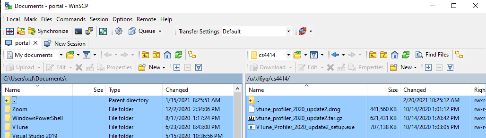

# Using Intel VTune, the modern x86 profiler

This page describes VTune setup relevant to our experiments. It contains pointers to various information. 

## Why VTune

For performance debugging like this, our "roll-it-your-own" manual code instrumentation can be too rudimentary. Modern profiler has been a crucial tool. In short, programmer launches a tool ("profiler") which in turns launches the target program being profiled. The profiler collects key information about target program execution. 

Over the past decade, profiling has seen tremendous improvement, evolving from software-based instrumentation to hardware-assisted sampling. Today, profilers can provide rich information at low overhead. 

**Availability:** Intel used to charge a few thousand $$ for a VTune license. Now it's freely downloadable. 

> Aside: Arm's profiler is called DS-5. 

## Naming

**VTune** is Intel's profiler. Prior to 2018 it was called Intel "VTune Amplifier" (a marketing term). There are still some old documents online with the latter name. Many of the current VTune executables are still named with the "amplxe-" prefix. Today it is called "oneAPI VTune". Intel likes to tinker with marketing terms.

## Useful VTune documents

VTune's [front page](https://software.intel.com/content/www/us/en/develop/tools/vtune-profiler/get-started.html) feature short articles & videos. Recommended readings: 

* A quick introduction. This [video](https://software.intel.com/content/www/us/en/develop/videos/introduction-to-intel-vtune-amplifier.html) (7 min)
* A case study on profiling Linux program. This [video](https://software.intel.com/content/www/us/en/develop/videos/finding-application-hotspots-on-a-linux-system-with-intel-vtune-amplifier-xe.html) (4.5min)
* About CPU instruction pipeline: this [video](https://techdecoded.intel.io/quickhits/what-you-need-to-know-about-the-instruction-pipeline/?elq_cid=3074796&erpm_id=5831526#gs.9eq2sk) and [this article](https://techdecoded.intel.io/resources/understanding-the-instruction-pipeline/?-1882156948.1541449095&erpm_id=3147218&elq_cid=3074796&erpm_id=5831526#gs.9ee57j) . A good refresher on CPU architecture and for understanding architecture profiling results. 

There are more and you may skim them.

The official user guide is [here](https://software.intel.com/content/www/us/en/develop/documentation/vtune-help/top.html). It's long and you do NOT have to read from back to end. Just make sure when you Google/Bing (e.g. "vtune threading profiling"), only pick results coming from this user guide. 

## Setup
In our experiments, we run and profile our program on the **target** **machine** and view profile results on the **viewer machine**. 

**VTune version info**: 

| Profiler version               | Installation package               |
| ------------------------------ | ---------------------------------- |
| vtune_profiler_2020.2.0.610396 | vtune_profiler_2020_update2.tar.gz |

VTune has to be installed **both** machines.

**Machine 1: Viewer**: Your own computer. Can be Windows/Linux. (Mac has some issues. See below)

Download installation packages to your local machine:
 
  * Method 1 (recommended): download from Collab->resources->vtune
  * Method 2: ```scp portal.cs.virginia.edu:/u/xl6yq/cs4414/VTune_Profiler_2020_update2_setup.exe .```  (mac/Linux users should download dmg/tar.gz)
  * Method 3 (Win only): WinSCP, which can download files over SSH
    
    
Available packages: 

```
├── vtune_profiler_2020_update2.dmg         (for Mac)
├── m_oneapi_vtune_p_2022.2.0.172.dmg       (for Mac)
├── VTune_Profiler_2020_update2_setup.exe   (for Windows)
└── vtune_profiler_2020_update2.tar.gz      (for Linux)
```

* Windows users: It should just work. If you have issues installing the package, try the compatibility mode (right click the .exe -> Troubleshoot compatibility). If you have an AMD machine, VTune should work too (verified on: Ryzen 7 5800x, Windows 10 21H2, VTune 2020 Update2).

* Linux users: if the provided .tar.gz does not work, try the newest one from Intel. 

* Mac users: if you have an M1/M2 Mac, skip to "last resort" below. If you have an Intel Mac: try vtune_profiler_2020_update2.dmg first; if that crahes, try m_oneapi_vtune_p_2022.2.0.172.dmg which reportedly works on > Monterey 12.3 (e.g. verified to work on a Macbook 2017 (MacOS 12.6) with Intel i7); if that does not work, try the newest one from the Intel website; if no luck, skip to "last resort" below. 

* Last resort: (1) If none of the method works, Mac users may use the remote [Windows](https://www.cs.virginia.edu/wiki/doku.php?id=windows_server) provided by the CS IT. (2) Students may run the VTune viewer from the command line on granger1/2. Limitations apply. See [here](vtune-cmd.md). 

The newest VTune from [Intel](https://software.intel.com/content/www/us/en/develop/tools/vtune-profiler/choose-download.html#standalone).  

**Machine 2: Target**: A multicore Linux machine, e.g. our course server. We will call VTune from command lines to collect trace. 

**We recommend most students to use the course server as target. **

**Notes below are ONLY for students who want to use own Linux machine as the target.** 

Install VTune to: `/opt/intel/vtune_profiler`

Relaxing OS security 

```
# add to /etc/sysctl.conf
kernel.perf_event_paranoid=1
kernel.kptr_restrict=0
```

Make it effective

```
sudo sysctl -p   
```

* Must have modern Intel processors (Broadwell, Haswell or even newer). Cannot be AMD. FYI: granger1/2: Ubuntu 20.04 LTS on 2x Xeon 2630v4 Broadwell (10c20t), 20 cores.
* Preferred: Ubuntu 20.04 LTS with Linux kernel > 4.17. Some VTune event-based sampling [features](https://software.intel.com/content/www/us/en/develop/documentation/vtune-help/top/analyze-performance/parallelism-analysis-group/threading-analysis.html) depends on it. 

### Workflow: choose one mode that suits you


**Mode 1 (recommended) -- develop on the server, view results locally**: develop code on the server (via SSH terminals, VS code, mounted network filesystem, etc.). In this case, target & dev machines are the same. 

* Write code -> build binary -> (test to make sure it works correctly) -> profile the program with VTune the server 

* Download the profile results to your local machine (the viewer machine). This can be done from VSCode (or rsync, scp, ...)

* *Note: this does **NOT** mean using your local VTune to connect to the server* 

  

* View the results on your local VTune. 

  To associate execution hotspots with source lines or assembly (see below for an example), the local VTune needs the program source code & binary (which must be build with symbols and debugging information). You will have to fetch them from the server to your local machine after *every* source modification & rebuild. Consider automating this process with your script (e.g. rsync) 


**Mode 2 (if you so choose) -- develop on a personal Linux box:**  develop & build code on your local Linux machine; execute on the server for profiling. 

The workflow is similar to setup 1. A few things to note though: 

* Since we build programs locally and execute on the server, there *may* be issues due to library version mismatch, etc. It worked fine for me (local machine: Ubuntu 18.04 LTS on Intel i5). A nice side effect, however, is that you no longer need to fetch source & binaries from the server for the local VTune to access. 
* The path for ITT library. To use VTune's ITT [tracing API](https://software.intel.com/content/www/us/en/develop/documentation/vtune-help/top/api-support/instrumentation-and-tracing-technology-apis.html), e.g. for adding task markers, you will have to include C headers & link to the ITT libraries. They ship with the VTune installation. Make sure you point to the right path in building, e.g. by changing CMakeList.txt. 
* Be aware of local profiling results. If you try profiling on your local machine, the results may appear different than that on the target machine. Sometimes the difference may be confusing. 

**Instructor's pick (FYI).** It's a variant of mode 2. A bit complicated but works well for me. Locally I have a Windows machine (as the viewer) and a Linux machine (the dev machine) connected via GbE. They share a network filesystem (Samba). From the Windows machine I connect into the Linux machine (dev) via the terminal emulator of WSL2. I develop and briefly test program on the dev machine and rsync it to the server (target) for profiling. Then I rsync the profiling results to local (viewer) for viewing. 

## Trace collection

On the target machine (e.g. granger1/2): 

### Path setup (do this every time you login to the target)

```
source /opt/intel/vtune_profiler/vtune-vars.sh
export INTEL_LIBITTNOTIFY64=/opt/intel/vtune_profiler/lib64/runtime/libittnotify_collector.so
```

[Reference](# https://software.intel.com/content/www/us/en/develop/documentation/vtune-help/top/api-support/instrumentation-and-tracing-technology-apis/basic-usage-and-configuration/configuring-your-build-system.html#configuring-your-build-system) 

To automate, consider appending the above to your `~/.bashrc` on the target. 

### Example commands, to execute for each collection

```
# hotspot analysis
vtune -collect hotspots -knob sampling-mode=hw ./myprogram

# threading analysis
vtune -collect threading -knob sampling-and-waits=hw ./myprogram

# microarchitecture analysis
vtune -collect uarch-exploration ./myprogram

# For instance ...
vtune -collect hotspot -knob sampling-mode=hw ./list-p --iterations=1M --threads=1 --parts=1
```

### Profiling results

Will be stored in a subdirectory named as, e.g. "r000tr/", "r014ue/", "r027hs/". 

The numbers are assigned by VTune in an ascending manner. The last two letters are the analysis type. tr-"threading", ue-"microarchitecture exploration", "hs"-hotspot. 

Fetch the whole subdirectory to the viewer machine. On the viewer, open the directory using the VTune installation. 

## ITT API for tracemarker instrumentation

<!---- TODO--->

To visualize how workers have grabbed parts to work on, we can lightly instrument our source with VTune's ITT API. The API allows us to programmatically add markers to the VTune timeline. 

This is used in [exp2](./exp2.md#attempt-3-eliminate-stragglers-list-pml) for visualizing stragglers. 

To learn the use of API by example, search for "USE_VTUNE" in the project source code provided to you.

## What to do now

Set up VTune with your local machine and test the whole workflow with a simple program. 

