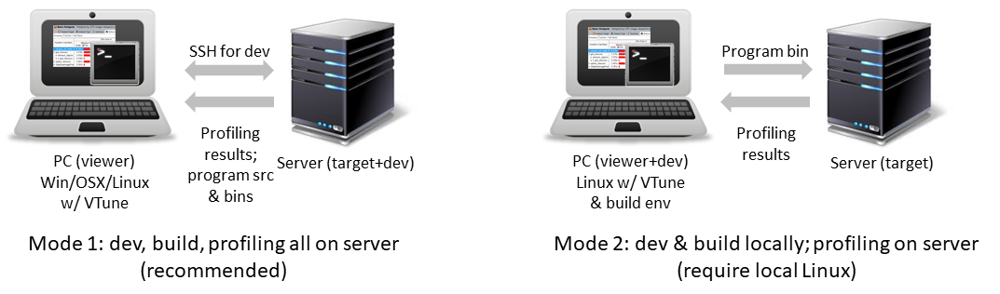
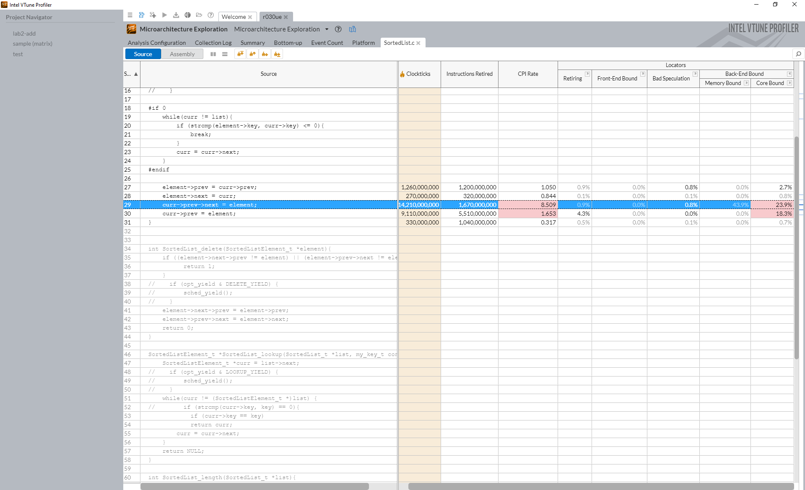

# Using Intel VTune, the modern x86 profiler

This page describes VTune setup relevant to our experiments. It contains pointers to various information. It does not substitute the user guide for VTune. 

## Why VTune

For performance debugging like this, we can no longer rely on our "roll-it-your-own" manual code instrumentation which is too rudimentary. Modern profiler has been a crucial tool. In short, programmer launches a tool ("profiler") which in turns launches the target program being profiled. The profiler collects key information about target program execution. 

Over the past decade, profiling has seen tremendous improvement, evolving from software-based instrumentation to hardware-assisted sampling. Today, the state-of-the-art profiler can both incur low overhead and provide rich information. 

**Availability:** Intel used to charge a few thousand $$ for a VTune license. Now it's freely downloadable [here](https://software.intel.com/content/www/us/en/develop/tools/vtune-profiler/choose-download.html#standalone). Thanks Intel!

> Aside: Arm's profiler is called DS-5, which IMHO is still not as mature as Intel VTune!

## Nomenclature

VTune is Intel's profiler. Prior to 2018 it was called Intel **VTune Amplifier** (a marketing term). There are still some old documents online with the latter name. Many of the current VTune executables are still named with the "amplxe-" prefix. 

## Useful VTune documents

VTune's [front page](https://software.intel.com/content/www/us/en/develop/tools/vtune-profiler/get-started.html) feature short articles & videos. Recommended readings: 

* A quick introduction. This [video](https://software.intel.com/content/www/us/en/develop/videos/introduction-to-intel-vtune-amplifier.html). 
* A case study on profiling Linux program. This [video](https://software.intel.com/content/www/us/en/develop/videos/finding-application-hotspots-on-a-linux-system-with-intel-vtune-amplifier-xe.html). 
* About CPU instruction pipeline: this [video](https://techdecoded.intel.io/quickhits/what-you-need-to-know-about-the-instruction-pipeline/?elq_cid=3074796&erpm_id=5831526#gs.9eq2sk) and [this article](https://techdecoded.intel.io/resources/understanding-the-instruction-pipeline/?-1882156948.1541449095&erpm_id=3147218&elq_cid=3074796&erpm_id=5831526#gs.9ee57j) . A good refresher on CPU architecture and for understanding architecture profiling results. 

There are more and you may skim them.

The official user guide is [here](https://software.intel.com/content/www/us/en/develop/documentation/vtune-help/top.html). It's long and you do NOT have to read from back to end. Just make sure when you Google (e.g. "vtune threading profiling"), only pick results coming from this user guide. 

## Setup
In our experiments, we run and profile our program on the **target** **machine** and view profile results on the **viewer machine**. 

**VTune version info** (Aug 2020): 

| OS (choose one)  | Profiler version               | Installation package               |
| ---------------- | ------------------------------ | ---------------------------------- |
| Ubuntu 18.04 LTS | vtune_profiler_2020.1.0.607630 | vtune_profiler_2020_update1.tar.gz |
| Ubuntu 20.04 LTS | vtune_profiler_2020.2.0.610396 | vtune_profiler_2020_update2.tar.gz |

VTune has to be installed on the following machines. 

* **Viewer machine** (do this yourself): Your own PC. Can be Windows/Linux/OSX. You need to download & install VTune from [here](https://software.intel.com/content/www/us/en/develop/tools/vtune-profiler/choose-download.html#standalone). Choose the standalone VTune version. 
* **Target machine** (the class server; we have already prepared this): A multicore Linux machine. VTune is installed at: `/data/intel/vtune_profiler` or `/opt/intel/vtune_profiler`. **We will use VTune from command line to collect trace.** 
  Want to set up your own target machine? Some notes: 
  * Must have modern Intel processors (Broadwell, Haswell or even newer). Cannot be AMD. 
  * Preferred: Ubuntu 20.04 LTS which ships with Linux kernel > 4.17. Some VTune event-based sampling [features](https://software.intel.com/content/www/us/en/develop/documentation/vtune-help/top/analyze-performance/parallelism-analysis-group/threading-analysis.html) depends on it. 
  * granger1 (WIP): Ubuntu 20.04 LTS on 2x Xeon 2630v4 Broadwell (10c20t), 20 cores.
  * labsrv06 (Aug 2020): Ubuntu 18.04 LTS on Intel Xeon Silver 4410 CPU (8c16t), 8 cores. 

**Dev machine (optional)**. This is the same as the target machine if you develop on the server. In case you choose to develop on your own Linux box, your own Linux box can be both the viewer & dev machine. Recommended: Ubuntu 20.04 LTS. 

### Workflow overview

Choose one of the two models that suit you. 


**Setup 1 -- develop on the server (for people who has no local Linux box)**: develop code on the server (either via SSH terminals or mount the server filesystem). In this case, target & dev machines are the same. 

* Write code -> build binary -> (test to make sure it works correctly) -> profile the program with VTune the server 

* Download the profile results to your PC (the viewer machine). This can be done via rsync, scp, or ftp. 

* View the results on local VTune. 

  To associate execution hotspots with source lines or assembly (see below for an example), the local VTune needs the program source code & binary (which must be build with symbols and debugging information). You will have to fetch them from the server to your local machine after *every* source modification & rebuild. Automate this process with your script! 

  

**Setup 2 -- develop on a personal Linux box:**  develop & build code on your local Linux machine; execute on the server for profiling. 

The workflow is similar to setup 1. A few things to note though: 

* Since we build programs locally and execute on the server, there *may* be issues due to library version mismatch, etc. It worked fine for me (local machine: Ubuntu 18.04 LTS on Intel i5). A nice side effect, however, is that you no longer need to fetch source & binaries from the server for the local VTune to access. 
* The path for ITT library. To use VTune's ITT [tracing API](https://software.intel.com/content/www/us/en/develop/documentation/vtune-help/top/api-support/instrumentation-and-tracing-technology-apis.html), e.g. for adding task markers, you will have to include C headers & link to the ITT libraries. They ship with the VTune installation. Make sure you point to the right path in building, e.g. by changing CMakeList.txt. 
* Be aware of local profiling results. If you try profiling on your local machine, the results may appear different than that on the target machine. Sometimes the difference may be confusing. 

**My setup (FYI).** It's a variant of setup 2. A bit complicated while it works well for me. Locally I have a Windows machine (as the viewer) and a Linux machine (the dev machine) connected via GbE. They share a network filesystem (Samba). From the Windows machine I connect into the Linux machine via the terminal emulator of WSL2. I develop and briefly test program on the dev machine and rsync it to the server for profiling. Then I rsync the profiling results back to local for viewing. 

## Trace collection

On the target machine: 

### Path setup (do this once, every time you login to the target)

```
source /opt/intel/vtune_profiler_2020.1.0.607630/vtune-vars.sh
export INTEL_LIBITTNOTIFY64=/opt/intel/vtune_profiler/lib64/runtime/libittnotify_collector.so
```

[Reference](# https://software.intel.com/content/www/us/en/develop/documentation/vtune-help/top/api-support/instrumentation-and-tracing-technology-apis/basic-usage-and-configuration/configuring-your-build-system.html#configuring-your-build-system) 

Consider adding these commands to your `~/.bashrc`

### Example collection command lines

```
# hotspot analysis
vtune -collect hotspots -knob sampling-mode=hw

# threading analysis
vtune -collect threading -knob sampling-and-waits=hw ./myprogram

# microarchitecture analysis
vtune -collect uarch-exploration ./myprogram
```

### Profiling results

Will be stored in a subdirectory named as, e.g. "r000tr/", "r014ue/", "r027hs/". 

The numbers are assigned by VTune in an ascending manner. The last two letters are the analysis type. tr-"threading", ue-"microarchitecture exploration", "hs"-hotspot. 

Fetch the whole subdirectory to the viewer machine. Open the directory from VTune. 

## ITT API for tracemarker instrumentation

<!---- TODO--->

To visualize how workers have grabbed parts to work on, we can lightly instrument our source with VTune's ITT API. The API allows us to programmatically add markers to the VTune timeline. 

To learn the use of API by example, search for "USE_VTUNE" in the project source code provided to you.

## What to do now

Set up VTune with your local machine and test the whole workflow with a simple program. 

